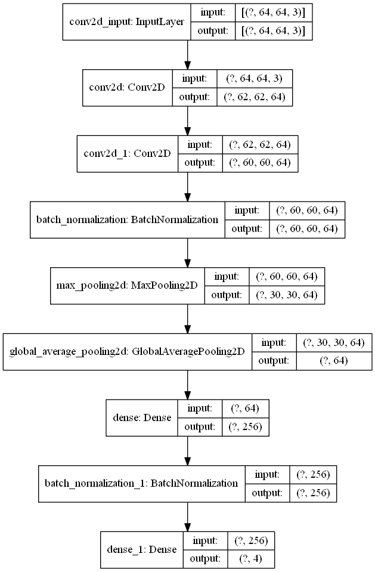
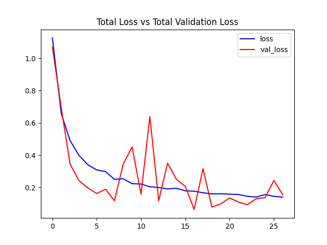
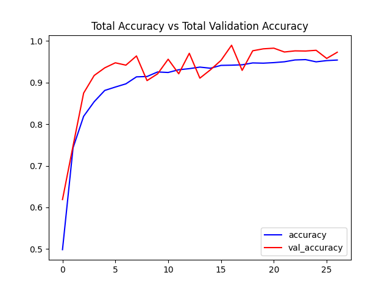

# Video-Classification-Using-DeepLearning-TensorFlow
Using a traditional CNN to classify videos by utilizing the moving average technique

This repo contains code to train a CNN Image Classifier and then use the trained model to classify videos.

## Data
This project uses the UCF50 - Action Recognition Data Set.
The data can be found [here](https://www.crcv.ucf.edu/data/UCF50.php).

It contains 50 action categories collected from youtube.  
  
They are:-  
  
Baseball Pitch, Basketball Shooting, Bench Press, Biking, Biking,  
Billiards Shot, Breaststroke, Clean and Jerk, Diving, Drumming,  
Fencing, Golf Swing, Playing Guitar, High Jump, Horse Race,  
Horse Riding, Hula Hoop, Javelin Throw, Juggling Balls, Jump Rope,  
Jumping Jack, Kayaking, Lunges, Military Parade, Mixing Batter,  
Nun chucks, Playing Piano, Pizza Tossing, Pole Vault,Pommel Horse,  
Pull Ups, Punch, Push Ups, Rock Climbing Indoor, Rope Climbing,  
Rowing, Salsa Spins, Skate Boarding, Skiing, Skijet,  
Soccer Juggling, Swing, Playing Tabla, TaiChi, Tennis Swing,  
Trampoline Jumping, Playing Violin, Volleyball Spiking, Walking with a dog, and Yo Yo.  

## Notes

* `config.py` contains all the configuration settings from data directory to image dimensions to class subset. Feel free to change this according to your will.
* `utils.py` contains all the utility functions such as plotting metrics, downloading from YouTube, performing inference in various modes, etc.
* `video_classifier.py` contains the code to train the model.
* `inference.py` contains the code to perform inference in differnt modes. We can also change the average no. of frames to perform inference.  

## Plots
Our model structure:-  
  
Training Loss Plot:-  
  
Training Accuracy Plot:-  

